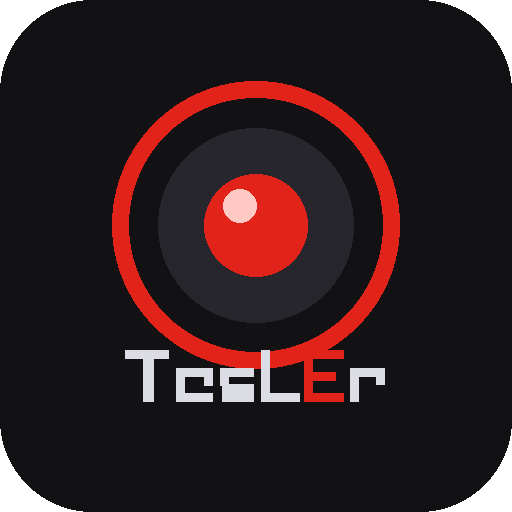

# TesLEr - Tesla sentineL viewEr
> An open source app for viewing all sentry clips in your TeslaDrive

  

## Made with      

This is a pnpm workspace with three packages: `tesler-desktop` (Electron/React, macOS/Windows/Linux), `tesler-app` (Expo/React Native, Android/iOS) and `tesler-core` (shared types & utils, [published on npm](https://www.npmjs.com/package/tesler-core)). See [AGENTS.md](AGENTS.md) for the full architecture and commands.

### Mobile (`tesler-app`)
- Android: browse TeslaCam clips straight off the USB drive (Storage Access Framework), view event details, play per-camera footage, delete clips — see [packages/tesler-app/docs/USB_FILE_ACCESS.md](packages/tesler-app/docs/USB_FILE_ACCESS.md)
- Generate an installable Android APK with `pnpm build:apk` in `packages/tesler-app` ([EAS Build](https://docs.expo.dev/build/introduction/), preview profile)
- iOS USB access still TBD — needs a native Expo Module with security-scoped bookmarks (Phase 2 in USB_FILE_ACCESS.md)

## TBD
### Features
- [#3](https://github.com/j-catania/TeslaSentinelViewer/issues/3) Add event time in slider
- [#2](https://github.com/j-catania/TeslaSentinelViewer/issues/2) See other clips from drive #2
- Deploy to Mac App Store
- Deploy to Windows Store
- Adding some tests (with Jest and playwright (e2e))
- Read the TeslaCam USB drive from `tesler-app` on iOS (native Expo Module + security-scoped bookmarks)
- Submit `tesler-app` to the Play Store / App Store (EAS `production` build profile is ready, submission isn't set up yet)

### Bugs
- [#1](https://github.com/j-catania/TeslaSentinelViewer/issues/1) Moving time via slider
- [#4](https://github.com/j-catania/TeslaSentinelViewer/issues/4) Reading USB drive for Windows

## Thanks
- [electron-vite-react](https://github.com/electron-vite/electron-vite-react)
